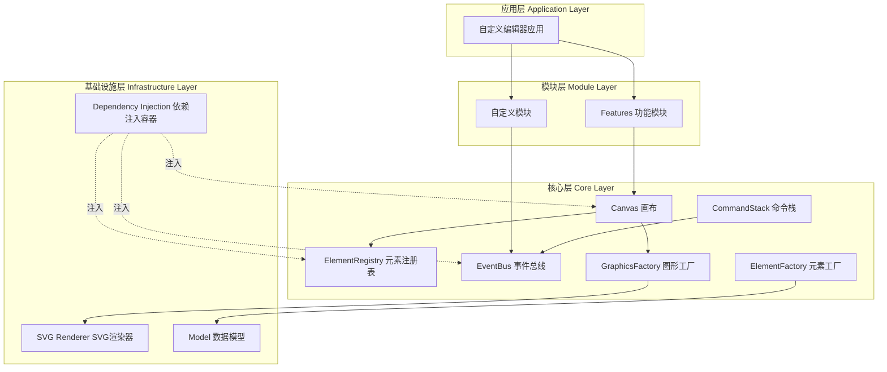
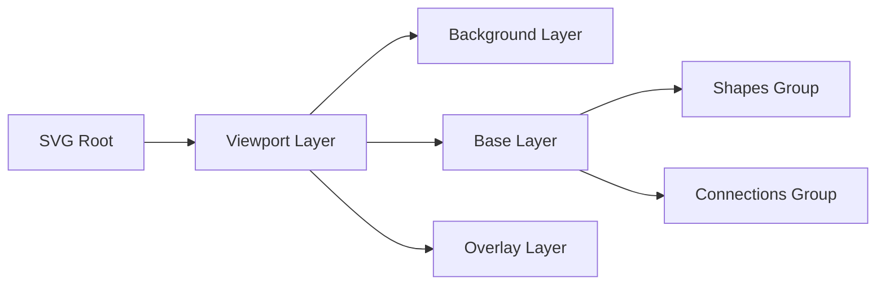
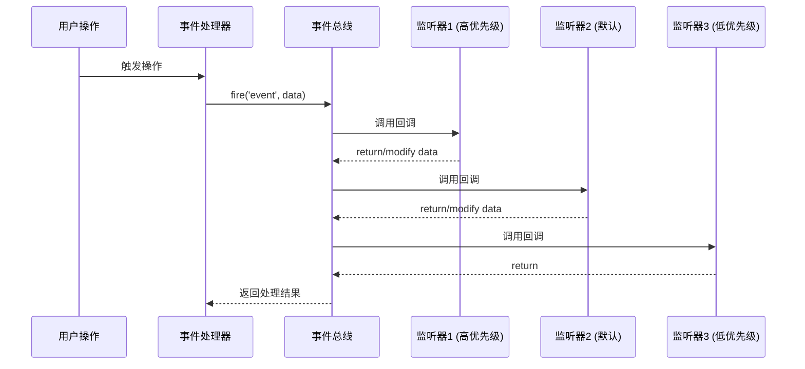
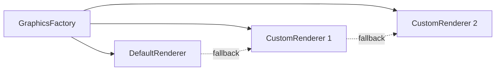
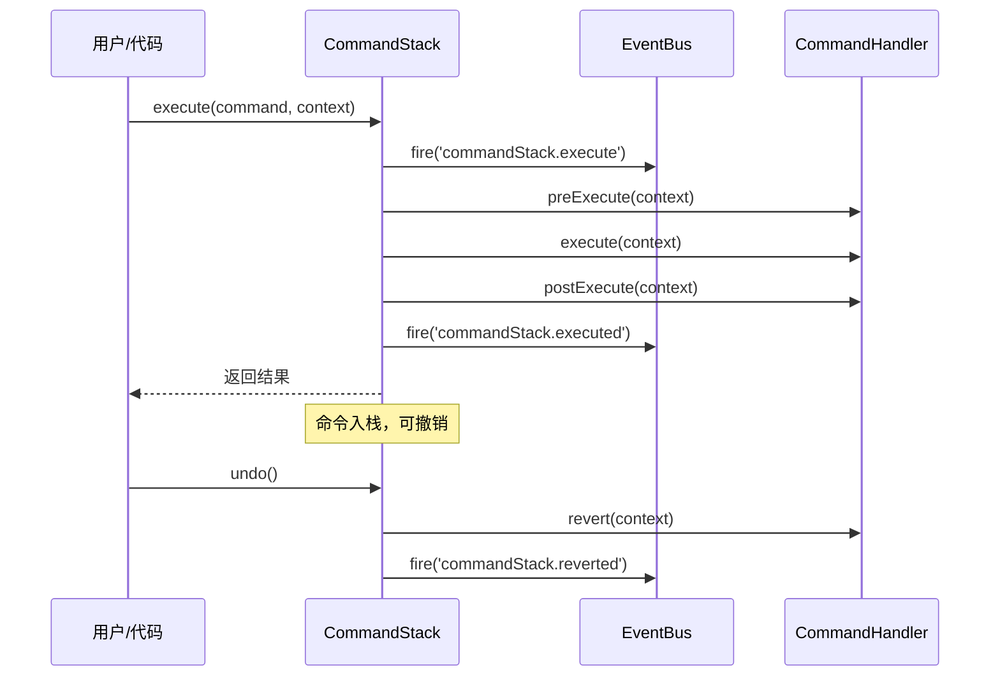

# 核心架构与设计原理

## 架构概览

diagram-js 采用模块化的架构设计，通过依赖注入和事件驱动的方式实现高度可扩展的图表编辑器框架。整个系统围绕以下核心理念构建：

- **模块化设计**：所有功能都封装为独立的模块，便于组合和定制
- **依赖注入**：使用 [didi](https://github.com/nikku/didi) 实现松耦合的组件依赖管理
- **事件驱动**：通过事件总线实现组件间的通信
- **命令模式**：所有修改操作都通过命令栈执行，自动支持撤销/重做

### 架构全景图



## 核心组件详解

### Canvas - 画布核心

`Canvas` 是 diagram-js 的核心组件，负责管理整个图表的渲染和视图层次。

**主要职责：**

- 管理 SVG 根元素和图层结构
- 提供视图变换（缩放、平移）
- 管理根元素（Root Elements）
- 计算和维护视图框（ViewBox）

**关键 API：**

```typescript
interface Canvas {
  // 获取根元素
  getRootElement(): Shape;

  // 设置根元素
  setRootElement(root: Shape): void;

  // 添加形状到画布
  addShape(shape: Shape, parent?: Shape): SVGElement;

  // 添加连接线到画布
  addConnection(connection: Connection, parent?: Shape): SVGElement;

  // 获取 SVG 容器
  getContainer(): HTMLElement;

  // 视图框操作
  viewbox(box?: Rect): Rect;
  zoom(newScale: number | "fit-viewport", center?: Point): number;
  scroll(delta: Point): void;
}
```

**图层管理：**



### ElementRegistry - 元素注册表

`ElementRegistry` 维护所有图表元素的索引，提供快速查询和访问能力。

**主要职责：**

- 存储和索引所有元素（Shape、Connection、Label）
- 提供元素的快速查找
- 管理元素与 SVG DOM 节点的映射关系

**关键 API：**

```typescript
interface ElementRegistry {
  // 通过 ID 获取元素
  get(id: string): Element;

  // 获取所有元素
  getAll(): Element[];

  // 过滤元素
  filter(fn: (element: Element) => boolean): Element[];

  // 添加元素
  add(element: Element, gfx: SVGElement): void;

  // 移除元素
  remove(element: Element): void;

  // 更新元素 ID
  updateId(element: Element, newId: string): void;

  // 获取元素对应的图形节点
  getGraphics(element: Element): SVGElement;
}
```

### EventBus - 事件总线

`EventBus` 是 diagram-js 的神经中枢，所有组件间的通信都通过事件完成。

**事件优先级机制：**

事件监听器可以指定优先级，数字越大优先级越高：

```typescript
// 高优先级监听器（优先执行）
eventBus.on("element.click", 1500, function (event) {
  console.log("高优先级处理");
});

// 默认优先级 (1000)
eventBus.on("element.click", function (event) {
  console.log("默认优先级处理");
});

// 低优先级监听器
eventBus.on("element.click", 500, function (event) {
  console.log("低优先级处理");
});
```

**事件生命周期：**



**常用事件模式：**

```typescript
// 1. 简单监听
eventBus.on('element.changed', function(event) {
  const { element } = event;
  console.log('元素已更改:', element);
});

// 2. 一次性监听
eventBus.once('diagram.init', function() {
  console.log('图表初始化完成');
});

// 3. 事件拦截和修改
eventBus.on('commandStack.execute', function(event) {
  // 可以修改事件数据
  event.context.customData = 'modified';
});

// 4. 事件取消
eventBus.on('element.move', function(event) {
  if (/* 某些条件 */) {
    return false; // 阻止事件继续传播
  }
});
```

### GraphicsFactory - 图形工厂

`GraphicsFactory` 负责创建和更新 SVG 图形元素。

**主要职责：**

- 根据模型数据创建 SVG 元素
- 更新现有 SVG 元素
- 管理渲染器（Renderer）

**渲染器链：**



**关键概念：**

```typescript
// 自定义渲染器示例
class CustomRenderer extends BaseRenderer {
  constructor(eventBus: EventBus) {
    super(eventBus, 1500); // 优先级 1500
  }

  canRender(element: Element): boolean {
    // 判断是否可以渲染此元素
    return element.type === "custom:Shape";
  }

  drawShape(visuals: SVGElement, element: Shape): SVGElement {
    const rect = svgCreate("rect");
    svgAttr(rect, {
      x: 0,
      y: 0,
      width: element.width,
      height: element.height,
      fill: "#3498db",
      stroke: "#2c3e50",
      "stroke-width": 2,
    });
    svgAppend(visuals, rect);
    return rect;
  }

  drawConnection(visuals: SVGElement, connection: Connection): SVGElement {
    // 绘制连接线
    return svgCreate("path");
  }
}
```

### ElementFactory - 元素工厂

`ElementFactory` 负责创建符合 diagram-js 规范的元素对象。

**元素类型：**

```typescript
// Shape - 形状元素
interface Shape extends Element {
  x: number;
  y: number;
  width: number;
  height: number;
  parent?: Shape;
  children?: Element[];
  host?: Shape; // 附加到的宿主元素
  attachers?: Shape[]; // 附加的元素列表
}

// Connection - 连接线
interface Connection extends Element {
  waypoints: Point[];
  source: Shape;
  target: Shape;
  parent?: Shape;
}

// Label - 标签
interface Label extends Shape {
  labelTarget: Element;
}

// Root - 根元素
interface Root extends Shape {
  // 根元素特有属性
}
```

**创建元素示例：**

```typescript
// 创建形状
const shape = elementFactory.createShape({
  id: "Shape_1",
  type: "custom:Task",
  x: 100,
  y: 100,
  width: 100,
  height: 80,
});

// 创建连接线
const connection = elementFactory.createConnection({
  id: "Connection_1",
  type: "custom:SequenceFlow",
  waypoints: [
    { x: 200, y: 140 },
    { x: 300, y: 140 },
  ],
  source: sourceShape,
  target: targetShape,
});
```

### CommandStack - 命令栈

`CommandStack` 实现命令模式，提供撤销/重做功能。

**命令执行流程：**



**实现自定义命令：**

```typescript
class MoveShapeHandler implements CommandHandler {
  execute(context: any) {
    const { shape, delta } = context;

    // 保存旧位置以便撤销
    context.oldPosition = {
      x: shape.x,
      y: shape.y,
    };

    // 执行移动
    shape.x += delta.x;
    shape.y += delta.y;

    return shape;
  }

  revert(context: any) {
    const { shape, oldPosition } = context;

    // 恢复到旧位置
    shape.x = oldPosition.x;
    shape.y = oldPosition.y;

    return shape;
  }
}

// 注册命令
class CustomModule {
  static $inject = ["commandStack"];

  constructor(commandStack: CommandStack) {
    commandStack.registerHandler("shape.move", MoveShapeHandler);
  }
}
```

## 依赖注入系统

diagram-js 使用 [didi](https://github.com/nikku/didi) 作为依赖注入容器。

### 模块声明

```typescript
// 定义模块
export default {
  __init__: ["customService"], // 自动初始化的服务
  __depends__: [CoreModule, SelectionModule], // 依赖的模块
  customService: ["type", CustomService], // 服务声明
  customRenderer: ["type", CustomRenderer],
};
```

### 服务注入

```typescript
class CustomService {
  // 声明依赖
  static $inject = ["eventBus", "canvas", "elementRegistry"];

  constructor(
    eventBus: EventBus,
    canvas: Canvas,
    elementRegistry: ElementRegistry,
  ) {
    this.eventBus = eventBus;
    this.canvas = canvas;
    this.elementRegistry = elementRegistry;

    // 初始化逻辑
    this.init();
  }

  init() {
    this.eventBus.on("element.click", (event) => {
      console.log("Element clicked:", event.element);
    });
  }
}
```

### 服务类型

- **type**: 标准服务，每次注入都创建新实例（默认）
- **factory**: 工厂函数，返回值作为服务
- **value**: 直接使用提供的值

```typescript
export default {
  // 类型服务
  myService: ["type", MyService],

  // 工厂服务
  config: [
    "factory",
    function () {
      return {
        apiUrl: "https://api.example.com",
        timeout: 5000,
      };
    },
  ],

  // 值服务
  version: ["value", "1.0.0"],
};
```

## SVG 渲染引擎

diagram-js 使用 SVG 作为渲染技术，提供高质量的矢量图形渲染。

### SVG 层次结构

```xml
<svg class="djs-container">
  <g class="viewport">
    <g class="layer-base">
      <g class="djs-group" data-element-id="Shape_1">
        <!-- 形状图形 -->
      </g>
      <g class="djs-group" data-element-id="Connection_1">
        <!-- 连接线图形 -->
      </g>
    </g>
    <g class="layer-overlays">
      <!-- 覆盖层内容 -->
    </g>
  </g>
</svg>
```

### 渲染优化

- **分层渲染**：不同类型的元素渲染在不同的图层
- **增量更新**：只更新变化的元素
- **虚拟化**：大型图表的性能优化（可选）
- **事件委托**：使用 SVG 的事件冒泡机制

## 性能考虑

### 事件处理优化

```typescript
// 避免在高频事件中执行昂贵操作
eventBus.on(
  "element.hover",
  500,
  debounce(function (event) {
    // 防抖处理
    updateTooltip(event.element);
  }, 100),
);
```

### 大规模图表优化

```typescript
// 批量操作
commandStack.execute("elements.move", {
  elements: largeElementArray, // 批量移动
  delta: { x: 100, y: 0 },
});

// 暂停渲染
canvas.suspendRendering();
// ... 执行多个操作
canvas.resumeRendering();
```

## 下一步

- 了解 [模块依赖关系](/guide/modules) 查看各模块间的依赖和集成方式
- 阅读 [扩展开发指南](/guide/extensions) 学习如何扩展 diagram-js
- 探索 [工作流程详解](/guide/workflow) 理解数据流和交互流程
