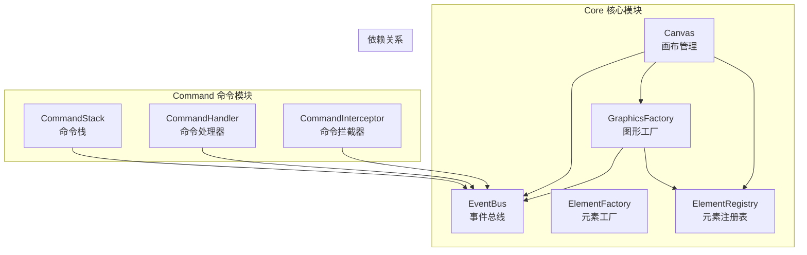
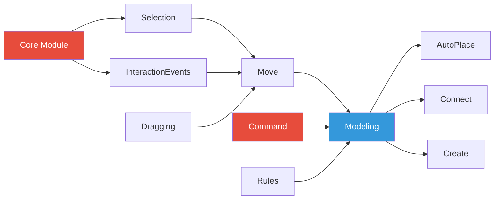
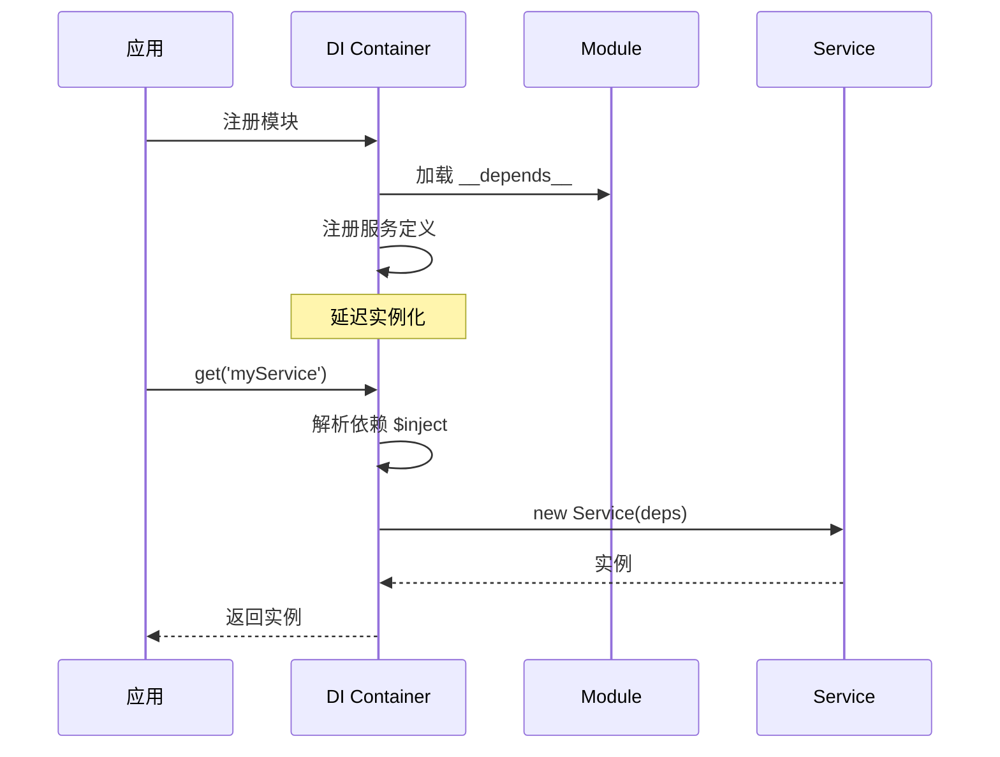

# 模块依赖关系与集成

## 模块系统概述

diagram-js 采用模块化架构，每个模块都是一个独立的功能单元。模块通过依赖注入（DI）容器进行管理和组合。

### 模块分类

diagram-js 的模块按功能划分为以下几类：

| 模块类型       | 说明         | 示例                               |
| -------------- | ------------ | ---------------------------------- |
| **Core**       | 核心基础服务 | Canvas, EventBus, ElementRegistry  |
| **Model**      | 数据模型定义 | Element, Shape, Connection         |
| **Command**    | 命令和操作   | CommandStack, CommandHandler       |
| **Features**   | 功能特性     | Selection, Move, Resize, Connect   |
| **Navigation** | 视图导航     | MoveCanvas, ZoomScroll             |
| **Layout**     | 布局算法     | ConnectionDocking, ManhattanLayout |
| **UI**         | 用户界面组件 | Palette, ContextPad, PopupMenu     |

## 核心模块依赖图



## 模块详解

### Core 核心模块

Core 模块提供 diagram-js 的基础服务，是所有其他模块的基础。

**模块定义：**

```typescript
// lib/core/index.ts
import Canvas from "./Canvas";
import ElementFactory from "./ElementFactory";
import ElementRegistry from "./ElementRegistry";
import EventBus from "./EventBus";
import GraphicsFactory from "./GraphicsFactory";

export default {
  __init__: ["canvas"],
  canvas: ["type", Canvas],
  elementFactory: ["type", ElementFactory],
  elementRegistry: ["type", ElementRegistry],
  eventBus: ["type", EventBus],
  graphicsFactory: ["type", GraphicsFactory],
};
```

**依赖关系：**

- Canvas → ElementRegistry, GraphicsFactory, EventBus
- GraphicsFactory → ElementRegistry, EventBus
- 无外部模块依赖（纯核心）

### Command 命令模块

Command 模块实现命令模式，提供可撤销的操作机制。

**模块定义：**

```typescript
// lib/command/index.ts
import CommandStack from "./CommandStack";
import CommandInterceptor from "./CommandInterceptor";

export default {
  __depends__: [
    require("../core"), // 依赖 Core 模块
  ],
  __init__: ["commandStack"],
  commandStack: ["type", CommandStack],
  commandInterceptor: ["type", CommandInterceptor],
};
```

**依赖关系：**

- 依赖：Core 模块
- CommandStack → EventBus
- CommandInterceptor → EventBus

### Features 功能模块

Features 模块提供各种图表编辑功能，是可选的增强模块。

#### Selection - 选择模块

```typescript
// lib/features/selection/index.ts
import Selection from "./Selection";
import SelectionVisuals from "./SelectionVisuals";

export default {
  __depends__: [require("../../core"), require("../interaction-events")],
  __init__: ["selection", "selectionVisuals"],
  selection: ["type", Selection],
  selectionVisuals: ["type", SelectionVisuals],
};
```

**依赖关系：**

- 依赖：Core, InteractionEvents
- Selection → EventBus, Canvas, ElementRegistry

#### Move - 移动模块

```typescript
// lib/features/move/index.ts
import Move from "./Move";
import MovePreview from "./MovePreview";

export default {
  __depends__: [
    require("../../core"),
    require("../dragging"),
    require("../modeling"),
    require("../selection"),
  ],
  __init__: ["move"],
  move: ["type", Move],
  movePreview: ["type", MovePreview],
};
```

**依赖关系：**

- 依赖：Core, Dragging, Modeling, Selection
- Move → EventBus, Dragging, Modeling

#### Modeling - 建模模块

```typescript
// lib/features/modeling/index.ts
import Modeling from "./Modeling";
import ElementFactory from "./ElementFactory";

export default {
  __depends__: [require("../../command"), require("../rules")],
  __init__: ["modeling"],
  modeling: ["type", Modeling],
  layouter: ["type", BaseLayouter],
};
```

**依赖链：**

- 依赖：Command, Rules
- Modeling → CommandStack, EventBus, ElementFactory

### Features 模块依赖图



## 依赖注入详解

### 模块声明语法

```typescript
export default {
  // 依赖的其他模块（在当前模块初始化前加载）
  __depends__: [CoreModule, CommandModule],

  // 自动初始化的服务（实例化但不需要被其他服务引用）
  __init__: ["selection", "selectionVisuals"],

  // 服务声明
  // 格式: serviceName: ['type', ServiceClass]
  selection: ["type", Selection],
  selectionVisuals: ["type", SelectionVisuals],

  // 工厂服务
  config: [
    "factory",
    function (eventBus) {
      return {
        /* config object */
      };
    },
  ],

  // 值服务
  version: ["value", "1.0.0"],
};
```

### 服务生命周期

1. **模块加载**：按依赖顺序加载模块
2. **服务注册**：将服务定义注册到 DI 容器
3. **依赖解析**：解析服务的 `$inject` 依赖
4. **服务实例化**：创建服务实例（延迟加载）
5. **自动初始化**：实例化 `__init__` 中的服务



### 服务注入示例

```typescript
class CustomService {
  // 声明依赖的服务名称
  static $inject = ["eventBus", "canvas", "elementRegistry", "modeling"];

  constructor(
    eventBus: EventBus,
    canvas: Canvas,
    elementRegistry: ElementRegistry,
    modeling: Modeling,
  ) {
    this.eventBus = eventBus;
    this.canvas = canvas;
    this.elementRegistry = elementRegistry;
    this.modeling = modeling;
  }

  doSomething() {
    const elements = this.elementRegistry.getAll();
    // ...
  }
}
```

## 模块间通信

### 事件驱动通信

模块间主要通过 EventBus 进行通信，避免直接依赖。

```typescript
// 模块 A：发布事件
class ModuleA {
  static $inject = ["eventBus"];

  constructor(eventBus: EventBus) {
    this.eventBus = eventBus;
  }

  performAction() {
    this.eventBus.fire("moduleA.actionPerformed", {
      data: "some data",
    });
  }
}

// 模块 B：监听事件
class ModuleB {
  static $inject = ["eventBus"];

  constructor(eventBus: EventBus) {
    eventBus.on("moduleA.actionPerformed", (event) => {
      console.log("ModuleA performed action:", event.data);
    });
  }
}
```

### 命令协同

不同模块可以通过命令系统协同工作：

```typescript
// Move 模块：执行移动命令
class Move {
  static $inject = ["modeling"];

  constructor(modeling: Modeling) {
    this.modeling = modeling;
  }

  start(element: Element) {
    // 使用 modeling 服务，最终调用 CommandStack
    this.modeling.moveElements([element], { x: 100, y: 0 });
  }
}

// Modeling 模块：提供建模 API
class Modeling {
  static $inject = ["commandStack"];

  constructor(commandStack: CommandStack) {
    this.commandStack = commandStack;
  }

  moveElements(elements: Element[], delta: Point) {
    this.commandStack.execute("elements.move", {
      elements,
      delta,
    });
  }
}
```

## 模块集成模式

### 基础集成

最简单的集成方式，只使用核心功能：

```typescript
import Diagram from "diagram-js";
import CoreModule from "diagram-js/lib/core";

const diagram = new Diagram({
  canvas: { container: "#canvas" },
  modules: [
    CoreModule, // 只包含核心功能
  ],
});
```

### 标准集成

包含常用功能模块：

```typescript
import CoreModule from "diagram-js/lib/core";
import SelectionModule from "diagram-js/lib/features/selection";
import MoveModule from "diagram-js/lib/features/move";
import ModelingModule from "diagram-js/lib/features/modeling";

const diagram = new Diagram({
  canvas: { container: "#canvas" },
  modules: [CoreModule, SelectionModule, MoveModule, ModelingModule],
});
```

### 完整集成

包含所有主要功能：

```typescript
import Diagram from "diagram-js";

// Diagram 默认导出已包含多数常用模块
const diagram = new Diagram({
  canvas: { container: "#canvas" },
  modules: [
    // 自动包含常用模块
  ],
});
```

### 自定义集成

替换或扩展默认模块：

```typescript
import CoreModule from "diagram-js/lib/core";
import CustomRenderingModule from "./custom-rendering";

const diagram = new Diagram({
  canvas: { container: "#canvas" },
  modules: [
    CoreModule,
    CustomRenderingModule, // 自定义模块
  ],
});
```

## 常见模块组合

### 只读查看器

```typescript
const modules = [
  CoreModule, // 核心渲染
  ZoomScrollModule, // 缩放滚动
  MoveCanvasModule, // 画布拖动
];
```

### 基础编辑器

```typescript
const modules = [
  CoreModule,
  SelectionModule, // 选择
  MoveModule, // 移动
  ModelingModule, // 建模操作
  CommandModule, // 撤销/重做
];
```

### 完整编辑器

```typescript
const modules = [
  CoreModule,
  SelectionModule,
  MoveModule,
  ResizeModule, // 调整大小
  ConnectModule, // 连线
  CreateModule, // 创建元素
  ModelingModule,
  PaletteModule, // 工具面板
  ContextPadModule, // 上下文菜单
  KeyboardModule, // 键盘快捷键
  CopyPasteModule, // 复制粘贴
  AlignElementsModule, // 对齐
  SnappingModule, // 吸附
];
```

## TypeScript 类型支持

### 服务类型定义

```typescript
// 定义服务接口
interface ICustomService {
  doSomething(): void;
  getData(): any;
}

// 实现服务
class CustomService implements ICustomService {
  static $inject = ["eventBus"];

  constructor(private eventBus: EventBus) {}

  doSomething(): void {
    // implementation
  }

  getData(): any {
    return {};
  }
}

// 模块类型
interface CustomModule extends DiagramModule {
  customService: ModuleDeclaration<ICustomService>;
}
```

### 扩展 Diagram 类型

```typescript
// 扩展 Diagram 类型以包含自定义服务
declare module "diagram-js/lib/Diagram" {
  interface Diagram {
    get(service: "customService"): ICustomService;
  }
}

// 使用时获得类型支持
const customService = diagram.get("customService"); // 类型为 ICustomService
```

## 模块调试

### 查看已加载模块

```typescript
// 获取所有注册的服务
const services = diagram._container._providers;
console.log(Object.keys(services));
```

### 服务依赖分析

```typescript
// 查看服务的依赖
function analyzeDependencies(serviceName: string) {
  const service = diagram.get(serviceName);
  const deps = service.constructor.$inject || [];
  console.log(`${serviceName} depends on:`, deps);
}

analyzeDependencies("modeling");
// 输出: modeling depends on: ['eventBus', 'commandStack', 'elementFactory']
```

## 下一步

- 查看 [核心架构详解](/guide/architecture) 了解各组件的内部实现
- 阅读 [扩展开发指南](/guide/extensions) 学习如何创建自定义模块
- 探索 [工作流程详解](/guide/workflow) 理解模块间的协作流程
- 参考 [API 文档](/api/core/Canvas) 查看具体服务的 API
