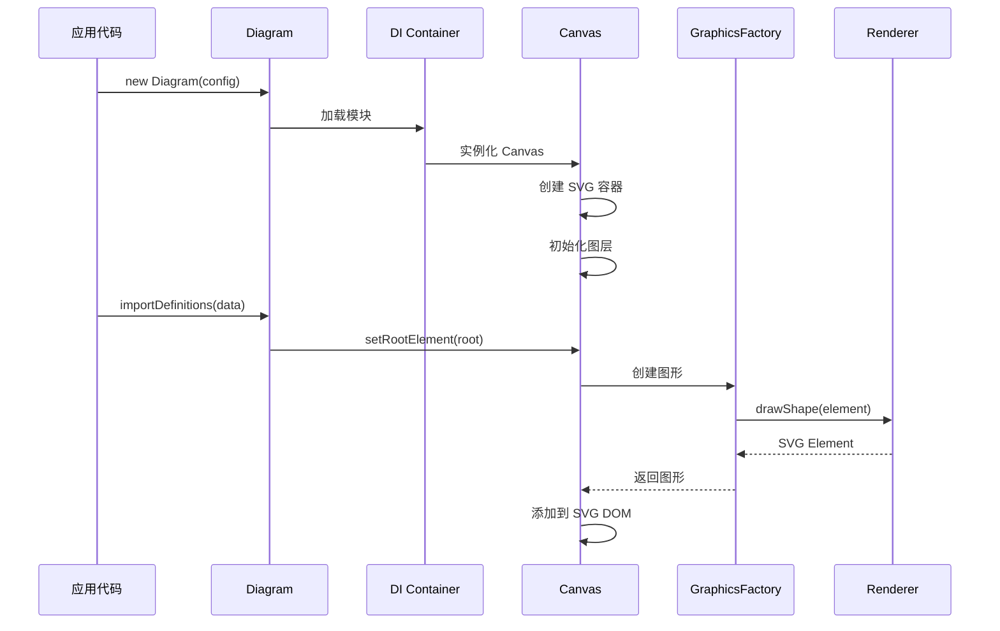
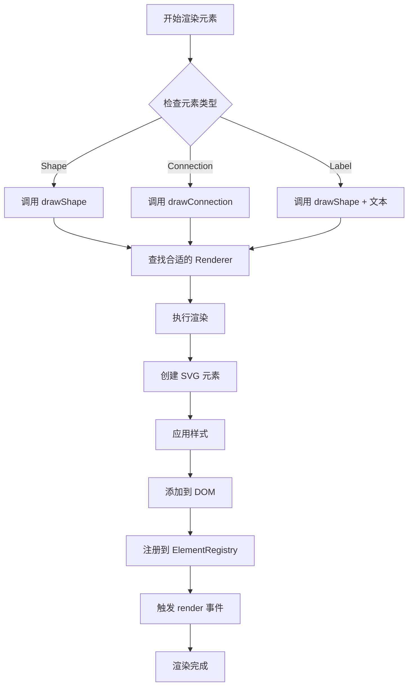
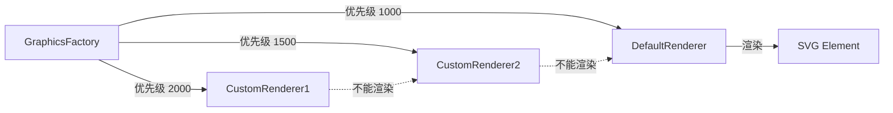
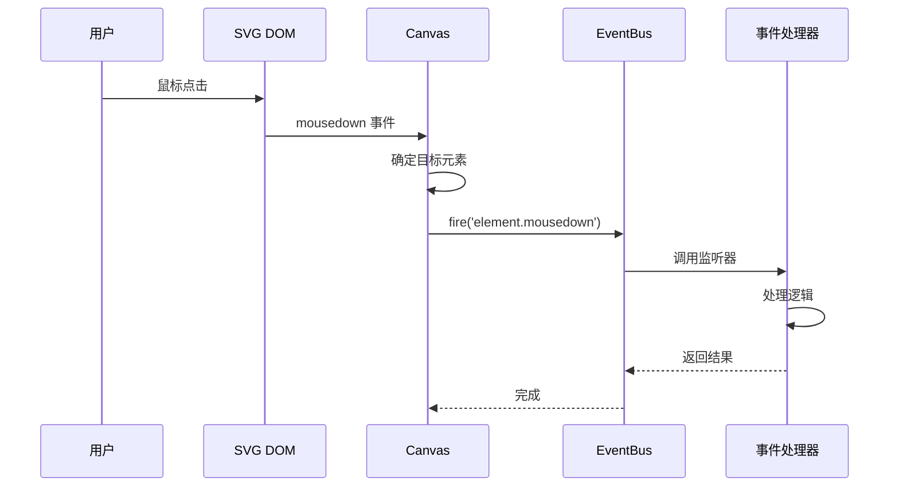
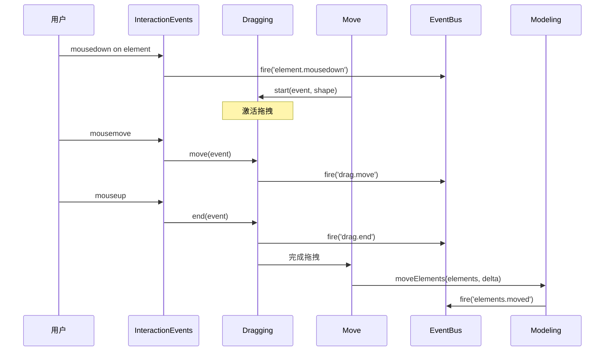
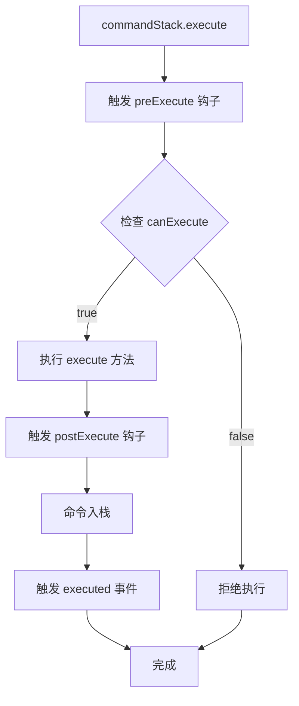
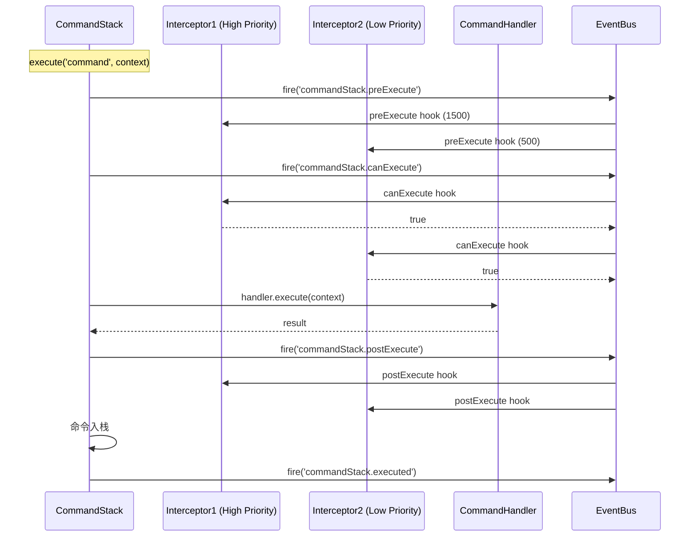
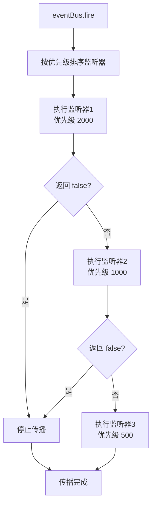

# 工作流程与数据流

## 概述

本文档详细介绍 diagram-js 中各个关键流程的工作机制，包括渲染流程、交互流程、命令执行流程和事件传播机制。

理解这些流程对于：

- 调试问题
- 性能优化
- 扩展开发

至关重要。

## 渲染流程

### 初始化渲染

从创建 Diagram 实例到首次渲染的完整流程。



### 元素渲染流程

单个元素的渲染过程。



### 渲染器优先级

多个渲染器按优先级链式调用，直到找到能够渲染的渲染器。

```typescript
// 渲染器链执行过程
class GraphicsFactory {
  draw(type: string, element: Element, parentGfx: SVGElement) {
    // 按优先级排序的渲染器列表
    const renderers = this._renderers.sort((a, b) => b.priority - a.priority);

    for (const renderer of renderers) {
      // 检查是否可以渲染
      if (renderer.canRender(element)) {
        // 执行渲染
        return renderer[type](parentGfx, element);
      }
    }

    throw new Error("No renderer found for " + element.type);
  }
}
```

**优先级示例：**



### 更新现有元素

元素属性变化时的重绘流程。

```typescript
// 更新流程示例
eventBus.on("element.changed", function (event) {
  const { element, gfx } = event;

  // 1. 清除旧的图形
  clear(gfx);

  // 2. 重新绘制
  graphicsFactory.update("shape", element, gfx);

  // 3. 触发更新事件
  eventBus.fire("element.updated", { element, gfx });
});
```

## 交互流程

### 鼠标事件处理

从原生 DOM 事件到 diagram-js 事件的转换过程。



### 拖拽流程

元素拖拽的完整生命周期。



### 选择流程

元素选择的处理过程。

```typescript
// 选择流程
class Selection {
  select(element: Element, add = false) {
    // 1. 触发 selection.changing 事件（可取消）
    const allowed = this.eventBus.fire("selection.changing", {
      oldSelection: this._selectedElements,
      newSelection: add ? [...this._selectedElements, element] : [element],
    });

    if (allowed === false) {
      return; // 选择被取消
    }

    // 2. 更新选择状态
    if (!add) {
      this.deselect(this._selectedElements);
    }
    this._selectedElements.push(element);

    // 3. 添加视觉反馈
    this._selectionVisuals.add(element);

    // 4. 触发 selection.changed 事件
    this.eventBus.fire("selection.changed", {
      newSelection: this._selectedElements,
      oldSelection: [],
    });
  }
}
```

## 命令执行流程

### 命令生命周期

从执行到撤销/重做的完整流程。



### 命令拦截器

CommandInterceptor 允许在命令执行的各个阶段插入逻辑。

```typescript
class CustomInterceptor extends CommandInterceptor {
  static $inject = ["eventBus"];

  constructor(eventBus: EventBus) {
    super(eventBus);

    // 在命令执行前
    this.preExecute("elements.move", (event) => {
      console.log("准备移动元素:", event.context.elements);
      // 可以修改 context
      event.context.customData = "modified";
    });

    // 检查是否允许执行
    this.canExecute("elements.delete", (event) => {
      const { elements } = event.context;
      // 不允许删除锁定的元素
      return !elements.some((e) => e.locked);
    });

    // 在命令执行后
    this.executed("elements.create", (event) => {
      console.log("元素已创建:", event.context.elements);
      // 执行额外逻辑
      this.updateExternalSystem(event.context);
    });

    // 在命令恢复后（撤销）
    this.reverted("elements.move", (event) => {
      console.log("移动已撤销");
    });
  }
}
```

### 命令执行顺序



### 撤销/重做机制

```typescript
class CommandStack {
  private _stack: any[] = [];
  private _stackIdx = -1;

  execute(command: string, context: any) {
    // 执行命令
    const result = this._execute(command, context);

    // 清除重做历史
    this._stack = this._stack.slice(0, this._stackIdx + 1);

    // 命令入栈
    this._stack.push({ command, context, result });
    this._stackIdx++;

    return result;
  }

  undo() {
    if (!this.canUndo()) return;

    const action = this._stack[this._stackIdx];
    const handler = this._getHandler(action.command);

    // 调用 revert 方法
    handler.revert(action.context);

    this._stackIdx--;
    this.eventBus.fire("commandStack.reverted", action);
  }

  redo() {
    if (!this.canRedo()) return;

    this._stackIdx++;
    const action = this._stack[this._stackIdx];
    const handler = this._getHandler(action.command);

    // 重新执行
    handler.execute(action.context);

    this.eventBus.fire("commandStack.executed", action);
  }

  canUndo(): boolean {
    return this._stackIdx >= 0;
  }

  canRedo(): boolean {
    return this._stackIdx < this._stack.length - 1;
  }
}
```

## 事件传播机制

### 事件生命周期



### 事件优先级和传播

```typescript
// 高优先级监听器可以阻止低优先级监听器
eventBus.on("element.click", 2000, function (event) {
  if (event.element.locked) {
    console.log("元素已锁定");
    return false; // 阻止后续监听器
  }
});

// 这个监听器可能不会被执行（如果元素被锁定）
eventBus.on("element.click", 1000, function (event) {
  console.log("元素点击:", event.element);
});
```

###事件数据传递和修改

```typescript
// 监听器可以修改事件数据
eventBus.on("commandStack.execute", 1500, function (event) {
  // 添加额外数据
  event.context.timestamp = Date.now();
  event.context.user = getCurrentUser();
});

eventBus.on("commandStack.execute", 1000, function (event) {
  // 后续监听器可以访问修改后的数据
  console.log("Timestamp:", event.context.timestamp);
  console.log("User:", event.context.user);
});
```

### 异步事件处理

```typescript
// 注意：事件监听器应该是同步的
// 如果需要异步操作，使用以下模式

class AsyncHandler {
  static $inject = ["eventBus"];

  constructor(eventBus: EventBus) {
    eventBus.on("element.changed", (event) => {
      // 立即返回，在后台执行异步操作
      this.handleAsync(event).catch(console.error);
    });
  }

  async handleAsync(event: any) {
    await this.syncToServer(event.element);
    console.log("同步完成");
  }
}
```

## 完整操作流程示例

### 创建并连接元素

展示一个完整的用户操作如何触发各个系统的协同工作。

```mermaid
sequenceDiagram
    participant User as 用户
    participant Palette as Palette
    participant Create as Create
    participant Modeling as Modeling
    participant CS as CommandStack
    participant CH as CreateHandler
    participant Canvas as Canvas
    participant GF as GraphicsFactory
    participant EB as EventBus

    User->>Palette: 点击工具
    Palette->>Create: start(event, shape)
    Create->>EB: fire('create.start')

    Note over User: 拖动到画布

    User->>Create: move(event)
    Create->>EB: fire('create.move')

    User->>Create: end(event)
    Create->>Modeling: createShape(shape, position)
    Modeling->>CS: execute('shape.create', context)

    CS->>EB: fire('commandStack.execute')
    CS->>CH: execute(context)
    CH->>Canvas: addShape(shape)
    Canvas->>GF: drawShape(shape)
    GF-->>Canvas: SVG Element
    Canvas->>EB: fire('shape.added')
    CH-->>CS: shape
    CS->>EB: fire('commandStack.executed')

    Note over User: 成功创建元素
```

### 建模操作链

展示多个建模操作的关联执行。

```typescript
// 复杂建模操作
class ComplexModeling {
  static $inject = ["modeling", "elementFactory"];

  createConnectedTasks(source: Shape, count: number) {
    let current = source;
    const tasks: Shape[] = [];

    for (let i = 0; i < count; i++) {
      // 创建新任务
      const task = this.elementFactory.createShape({
        type: "custom:Task",
        x: current.x + 200,
        y: current.y,
        width: 100,
        height: 80,
      });

      // 添加到画布
      this.modeling.createShape(task, { x: task.x, y: task.y }, current.parent);

      // 创建连接
      this.modeling.connect(current, task);

      tasks.push(task);
      current = task;
    }

    return tasks;
  }
}
```

每个操作都会：

1. 触发 `commandStack.execute` 事件
2. 执行相应的 CommandHandler
3. 更新 Canvas 和 DOM
4. 触发 `commandStack.executed` 事件
5. 允许撤销/重做

## 性能优化流程

### 批量渲染

```typescript
// 暂停渲染，批量操作后恢复
canvas.suspendRendering();

try {
  // 执行大量操作
  for (const element of elements) {
    modeling.moveElements([element], delta);
  }
} finally {
  // 恢复渲染，一次性更新
  canvas.resumeRendering();
}
```

### 事件防抖

```typescript
import { debounce } from "min-dash";

class OptimizedHandler {
  static $inject = ["eventBus"];

  constructor(eventBus: EventBus) {
    // 防抖处理高频事件
    const debouncedHandler = debounce((event) => {
      this.expensiveOperation(event);
    }, 300);

    eventBus.on("canvas.viewbox.changed", debouncedHandler);
  }

  expensiveOperation(event: any) {
    // 昂贵的计算或网络请求
  }
}
```

## 调试工作流程

### 事件追踪

```typescript
// 追踪所有事件
const eventLog: any[] = [];

eventBus.on("*", function (type, event) {
  eventLog.push({
    timestamp: Date.now(),
    type: type,
    data: event,
  });
});

// 导出事件日志
function exportEventLog() {
  console.table(eventLog);
  return eventLog;
}
```

### 命令历史

```typescript
// 查看命令历史
function showCommandHistory(commandStack: CommandStack) {
  const stack = commandStack._stack;
  const currentIdx = commandStack._stackIdx;

  stack.forEach((action, idx) => {
    const marker = idx === currentIdx ? "→" : " ";
    console.log(`${marker} ${idx}: ${action.command}`, action.context);
  });
}
```

## 下一步

- 查看 [核心架构详解](/guide/architecture) 了解各组件的实现机制
- 阅读 [模块依赖关系](/guide/modules) 理解模块协作
- 探索 [扩展开发指南](/guide/extensions) 学习如何扩展流程
- 参考 [API 文档](/api/core/EventBus) 查看事件 API
